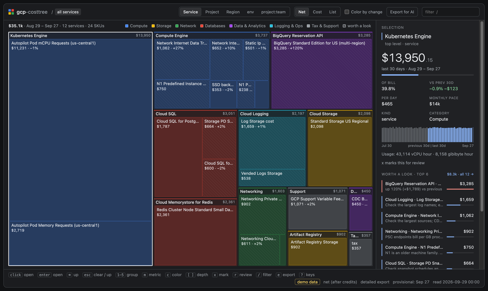

# gcp-costtree

Where did my GCP money go? `gcp-costtree` reads your Cloud Billing BigQuery export and writes one
self-contained HTML treemap: box size is cost, you drill down from service to SKU to resource, waste
is hatched, and you can mark boxes to build a savings list.

Inspired by [awstree](https://github.com/petricbranko/awstree) and [disktree](https://github.com/tobi/disktree); see [Credits](#credits).

## Quick start

    python3 gcp_costtree.py --demo                      # fake data, no GCP access
    python3 gcp_costtree.py --table PROJECT.DATASET.TABLE --dry-run
    python3 gcp_costtree.py --table PROJECT.DATASET.TABLE --label env

Needs Python 3.11+ and the `gcloud` CLI (or a token in `GCP_COSTTREE_TOKEN`). No pip installs.

## Setup

1. Enable the billing export: Billing → your account → Billing export → BigQuery export. Enable
   **Detailed usage cost** for resource-level boxes, or **Standard usage cost** for the cheaper
   service/SKU view. Use a `US` or `EU` multi-region dataset. The first data can take hours to arrive.
2. Permissions: `bigquery.jobs.create` on the project that runs the queries (`--job-project`, default:
   the table's project), and `bigquery.tables.get` + `bigquery.tables.getData` on the export table.
3. For a service account: `export GCP_COSTTREE_TOKEN="$(gcloud auth print-access-token --impersonate-service-account=SA_EMAIL)"`.

## What it costs

Each run does a free dry run first and stops if a query would scan more than `--max-gb` (default 50 GB
per query). A 30-day run on a mid-size detailed export scans about 0.1–1 GB. `--from out/gcp-costtree-data.json`
re-renders without querying.

## Output

- `out/gcp-costtree.html`: the viewer. Works offline; it makes no network requests.
- `out/gcp-costtree-data.json`: the cache, written next to the HTML (so `--out` moves it too).
- `--export`: a compact JSON summary (≤ 64 KB) for AI agents. Press `e` in the viewer for the same summary plus your marks (the viewer's copy is trimmed to 48 KB first to leave room for them).

**The HTML contains project IDs, resource names, and label values. Share it accordingly.** The billing
account ID is left out.

## Reading the numbers

- **Usage period, not invoice.** Costs are attributed to the UTC day the usage started. Totals won't match an
  invoice, and the Billing console (Pacific time) can differ at day edges. Monthly charges (support fees, some
  subscriptions) start on the 1st of the month, so a window that starts later leaves them out.
- **net** = cost + credits (what you pay); **cost** = before credits; **list** = list price.
- The last `--lag-days` days (default 2) are skipped because the export arrives late; the last included day is
  marked provisional. Re-running later can change totals.
- `--end YYYY-MM-DD` picks the last day of the period instead, for example while a new export is still
  backfilling: `--end 2026-08-25 --days 14`. It must be before today (UTC), `--lag-days` is then ignored, and in
  the config file it is `end = "2026-08-25"`. The last day is still marked provisional (late rows can revise any
  day). The scan covers partitions up to today, so an old window can need a higher `--max-gb`.
- Comparisons use the previous period of the same length. If the export doesn't reach back that far,
  comparisons and the growth rule are switched off.
- The resource level (detailed export) keeps the top N resources per SKU (`--top-resources`) across all
  projects; the rest is `(other)`. In the project view, a small project's SKU can show only `(other)`.

## Keys

`?` in the viewer lists them all. Arrows move, `Enter` opens, `Backspace` goes up, `1`–`9` regroup,
`m` switches metric, `c` colors by change, `x` marks, `r` reviews marks, `/` filters by any name (service, SKU, project, region, label value, resource), `e` exports.

## Configuration

See `examples/gcp-costtree.example.toml`. CLI flags override the config file. Rules can be disabled,
re-thresholded (amounts are in the export's currency), or added.

## Development

    python3 -m unittest discover -s tests -t .
    node --test tests/viewer.test.mjs     # optional, Node 20+

## Credits

- [disktree](https://github.com/tobi/disktree) by Tobi Lütke: inspiration for the drill-down treemap,
  keyboard navigation, category colors, hatching for reclaimable items, and marking boxes for review.
- [awstree](https://github.com/petricbranko/awstree) by Branko Petric: the same idea applied to a cloud bill, and the
  viewer's layout and CSS, which gcp-costtree adapts (MIT; see [License](#license)).
- Colors are based on Google's brand and Material palettes. gcp-costtree is not affiliated with or endorsed by Google.

## License

MIT, Copyright (c) 2026 Alexios Polyzos. See [LICENSE](LICENSE).

`viewer.html` includes layout and CSS adapted from awstree, Copyright (c) 2026 Branko Petric, under the MIT License;
that notice is reproduced at the top of `viewer.html`.
